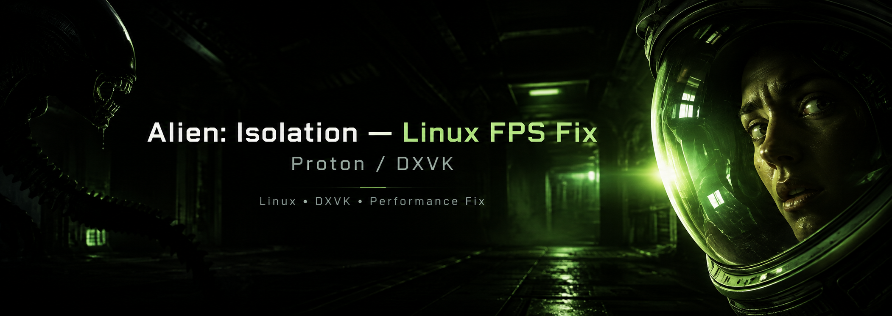

<p align="center">
  
</p>

<h1 align="center">Alien: Isolation Linux FPS Fix</h1>

<p align="center">
  One line of DXVK configuration that turns the game's worst scenes from 45 fps into 120+ fps on Linux.<br>
  No launch options, no mods, no DLL wrappers. Just a <code>dxvk.conf</code> in the game folder.
</p>

<p align="center">
  <a href="https://github.com/doitsujin/dxvk/pull/5948"></a>
  <a href="LICENSE"></a>
  
  
  <a href="README.pt-BR.md"></a>
</p>

---

## Table of contents

- [TL;DR](#tldr)
- [Do I have this problem?](#do-i-have-this-problem)
- [Install](#install)
  - [One-liner](#one-liner)
  - [Script options](#script-options)
  - [Manual install](#manual-install)
  - [Launch option instead of a file](#launch-option-instead-of-a-file)
- [Verify it is working](#verify-it-is-working)
- [What is going on](#what-is-going-on)
- [How the culprit was found](#how-the-culprit-was-found)
- [Tested on](#tested-on)
- [Compatibility and launchers](#compatibility-and-launchers)
- [FAQ and troubleshooting](#faq-and-troubleshooting)
- [Upstream status](#upstream-status)
- [Report your results](#report-your-results)
- [Credits](#credits)
- [License](#license)

## TL;DR

```bash
curl -fsSL https://raw.githubusercontent.com/sidnei-almeida/alien-isolation-linux-fix/main/install.sh | bash
```

Then restart the game. That's it.

| Scene (same save, same spot)         | Before    | After     |
|--------------------------------------|-----------|-----------|
| Tram station, looking out the door   | 40-50 fps | 120-130 fps |
| GPU load in that scene               | 31-45 %   | ~100 %    |
| Rest of the game                     | 100-140 fps | unchanged |

## Do I have this problem?

You very likely do if all of these are true:

- You run *Alien: Isolation* on Linux through Proton, Wine or any launcher that uses DXVK.
- In some areas (tram stations are the classic one) the frame rate drops hard, often by half or more.
- While it happens, your GPU is **not** busy: 30-50 % load, clocks at maximum, plenty of VRAM free.
- No CPU core is pegged at 100 % either. Everything looks idle and the game is still slow.
- Lowering graphics settings does almost nothing.
- Your GPU has Resizable BAR / Smart Access Memory enabled (check your BIOS, or `lspci -vv` for a BAR of several GB on the GPU).

If the GPU *is* at 100 % when the fps drops, that is an ordinary GPU limit and this fix won't help you.

## Install

### One-liner

```bash
curl -fsSL https://raw.githubusercontent.com/sidnei-almeida/alien-isolation-linux-fix/main/install.sh | bash
```

The script:

1. Reads `libraryfolders.vdf` from every Steam install it knows about (native, Flatpak, Snap) and checks each library for `steamapps/common/Alien Isolation/AI.exe`.
2. Also looks in common Heroic, Lutris and Bottles locations for an `AI.exe`.
3. Writes a `dxvk.conf` next to each `AI.exe` it finds, containing the fix.
4. If a `dxvk.conf` is already there, it keeps every other setting, backs the file up to `dxvk.conf.bak`, and only adds or replaces the one key it needs.

It is idempotent: running it again reports "Already installed" and changes nothing. It never needs `sudo`.

Prefer to read before you run? Clone the repo and run `./install.sh` locally. The script is about 150 lines of plain bash.

### Script options

```bash
# The game lives somewhere the script does not look
./install.sh --path "/mnt/games/SteamLibrary/steamapps/common/Alien Isolation"

# Several copies (e.g. Steam and GOG)
./install.sh --path "/path/one" --path "/path/two"

# Show what would be done without touching anything
./install.sh --dry-run

# Remove the fix (restores other dxvk.conf settings untouched)
./install.sh --uninstall
```

### Manual install

Create a file named `dxvk.conf` in the game folder (the one that contains `AI.exe`) with this content:

```ini
d3d11.cachedDynamicResources = a
```

Or just copy the [`dxvk.conf`](dxvk.conf) from this repository into that folder.

Typical paths:

| Launcher        | Folder |
|-----------------|--------|
| Steam (native)  | `~/.local/share/Steam/steamapps/common/Alien Isolation/` |
| Steam (Flatpak) | `~/.var/app/com.valvesoftware.Steam/.local/share/Steam/steamapps/common/Alien Isolation/` |
| Other library   | `<library>/steamapps/common/Alien Isolation/` |
| Heroic (GOG/Epic) | wherever you chose on install, usually under `~/Games/Heroic/` |

### Launch option instead of a file

If you'd rather not touch the game folder, this Steam launch option does the same thing:

```
DXVK_CONFIG="d3d11.cachedDynamicResources = a" %command%
```

Keep any other launch options you already use; just put this in front of `%command%`.

## Verify it is working

Add the DXVK HUD to your launch options once, so you can read the numbers in-game:

```
DXVK_HUD=fps,gpuload %command%
```

Load a save at a tram station, stand in the open door and look down the platform. Before the fix the HUD shows something like 45 fps with GPU load around 40 %. After the fix it should read well over 100 fps with GPU load near 100 % (or your monitor's refresh rate if V-Sync is on).

You can also confirm DXVK picked up the file by running the game once with `DXVK_LOG_LEVEL=info` and looking for the `cachedDynamicResources` line in the log it prints to stderr (or to `AI_d3d11.log` if `DXVK_LOG_PATH` is set).

Remove the HUD from the launch options afterwards.

## What is going on

*Alien: Isolation* (2014) runs on Creative Assembly's in-house engine. Like many engines of that era it updates a large number of **dynamic Direct3D 11 buffers every frame** and, crucially, **reads some of them back on the CPU** (`Map` with read access, or writes followed by reads to the same mapped memory).

On Windows with a native driver that is cheap. Under DXVK, dynamic resources are placed in the memory type DXVK thinks is best for *writing*. When your GPU exposes a large Resizable BAR window, that is **host-visible VRAM**: the CPU can write into it directly and the GPU reads it with no copy. Great for writes.

But every CPU *read* from host-visible VRAM is an uncached transaction across PCIe. It is hundreds of times slower than reading system RAM. The game's render thread does thousands of those reads per frame in heavy scenes, so it spends most of its time stalled on memory. It isn't "busy" in the sense a profiler shows, it's *waiting*. The GPU, which only gets work once the render thread finishes, sits idle for most of the frame. That is why nothing looks saturated and the fps still collapses.

`d3d11.cachedDynamicResources = a` tells DXVK to allocate **all** dynamic resources in cached system memory instead. Writes become slightly more expensive (the GPU now reads over PCIe) but the CPU readbacks go back to RAM speed, and in this game that is the trade that matters. DXVK documents the option as a workaround for exactly this kind of application behaviour, and several other titles already ship with it as a per-game default (Crysis 3, Monster Hunter World, Kingdom Come: Deliverance, Darksiders, …).

## How the culprit was found

The symptom ("nothing is saturated, everything is slow") matches a lot of possible causes, so everything cheaper to test was ruled out first. Each item below produced **identical** numbers at the same spot:

| Hypothesis | Test | Result |
|------------|------|--------|
| Mods (ReShade, Alias Isolation, mouse fix) | launch without the DLL overrides | no change |
| Expensive render passes | LOD/Enhanced Graphics Low, Planar Reflections off, Volumetric Lighting off | no change |
| CPU→GPU pipelining | `dxgi.maxFrameLatency = 3` | no change |
| Thread scheduling / SMT | `WINE_CPU_TOPOLOGY=6:0,2,4,6,8,10` (physical cores only) | no change |
| Wine synchronisation primitives | `PROTON_NO_NTSYNC=1` (fsync instead of ntsync) | no change, GPU load dropped further |
| CPU wake-up latency | checked C-state exit latencies | C2 exits in 18 µs, not a factor |
| Thread contention | counted wait syscalls per frame | nothing abnormal |

What finally pointed the right way:

1. A `perf record -p <pid>` of the game process showed roughly **40 % of all CPU time inside `d3d11.dll` (DXVK) and `libvulkan_intel.so`**, not in the game's own code. Whatever was slow, DXVK was in the middle of it.
2. `lspci -vv` showed the GPU with a **16 GB BAR**, i.e. Resizable BAR on, which is exactly the condition under which DXVK puts dynamic buffers in host-visible VRAM.
3. DXVK's own `dxvk.conf` documentation describes `cachedDynamicResources` as the knob for "buggy applications" that read back dynamic buffers.

One launch with the option set, same save, same door: 45 fps → 128 fps, GPU from 40 % to 100 %.

## Tested on

| Component | Version |
|-----------|---------|
| GPU       | Intel Arc B580 (Resizable BAR on, 16 GB BAR) |
| CPU       | AMD Ryzen 5 5500X3D |
| Mesa      | 26.2.4 (ANV Vulkan driver) |
| Kernel    | 7.2.5 |
| Proton    | GE-Proton 11-7, bundling DXVK v3.1 |
| Game      | Steam build, tested with and without ReShade / Alias Isolation / mouse fix |

The root cause is not vendor-specific. Any GPU with Resizable BAR or Smart Access Memory enabled (AMD, NVIDIA, Intel) should hit the same stall and benefit from the same fix. Reports from other hardware are very welcome, see [Report your results](#report-your-results).

## Compatibility and launchers

| Setup | Works? | Notes |
|-------|--------|-------|
| Steam + Proton (Valve or GE) | ✅ | `dxvk.conf` is read automatically |
| Steam Flatpak / Snap | ✅ | installer searches those paths |
| Heroic (GOG / Epic) | ✅ | DXVK is on by default; put `dxvk.conf` next to `AI.exe` |
| Lutris | ✅ | make sure DXVK is enabled in the runner options |
| Bottles | ✅ | make sure DXVK is enabled for the bottle |
| Plain Wine with DXVK | ✅ | same file, same place |
| Wine with WineD3D (no DXVK) | ❌ | the option is DXVK-specific; install DXVK first |
| Windows | ❌ | not applicable, native D3D11 doesn't have this problem |
| ReShade / Alias Isolation / mouse fix | ✅ | DLL wrappers in the game folder don't interfere; DXVK itself reads the file |

If you already have `DXVK_CONFIG=...` in your launch options from an earlier workaround, you can remove it. The file makes it redundant.

## FAQ and troubleshooting

**The script says it couldn't find `AI.exe`.**
Pass the folder explicitly with `--path "/your/path/Alien Isolation"`. Flatpak Steam users with libraries on other drives: the installer reads `libraryfolders.vdf`, but if the drive isn't mounted it won't see it.

**I installed it and nothing changed.**
Confirm the file is really next to `AI.exe` (`ls "<game folder>/dxvk.conf"`), that you restarted the game, and that you're actually running DXVK (Proton always is; Lutris/Bottles only if enabled). Then check the [verification](#verify-it-is-working) section. If GPU load was already ~100 % before, your bottleneck is a different one.

**Will a game update or Steam "verify files" remove it?**
Verify integrity only touches files that are part of the depot, so `dxvk.conf` survives it. A full reinstall deletes the folder; just run the installer again.

**Does it hurt performance anywhere?**
Not in this game, in our testing. Scenes that were already GPU-bound stayed the same. DXVK's docs warn the option "may reduce GPU-bound performance" in general, which is why it's a per-game setting and not a global default.

**Can I use a narrower setting than `a`?**
Yes. DXVK accepts any combination of `v` (vertex buffers), `i` (index buffers), `c` (constant buffers) and `r` (shader resources), e.g. `cv`. `a` is what was measured and is the safe default. If you test subsets, please report the numbers.

**I use Vortex / mod managers. Will they complain?**
No. `dxvk.conf` is an unmanaged file; Vortex ignores files it didn't deploy.

**I don't have Resizable BAR. Do I need this?**
Probably not, but it's harmless. Without ReBAR, DXVK already keeps most dynamic buffers in system memory and the readbacks are cheap.

**Can I just use the launch option?**
Yes, see [Launch option instead of a file](#launch-option-instead-of-a-file). The file is simply more durable and launcher-agnostic.

## Upstream status

The right place for this fix is inside DXVK itself, as a per-game default, so it ships with every Proton release and nobody needs this repository.

- **Pull request:** [doitsujin/dxvk#5948](https://github.com/doitsujin/dxvk/pull/5948): adds `d3d11.cachedDynamicResources = a` for `AI.exe` in `src/util/config/config.cpp`.

Once merged and picked up by Proton, this repo becomes a convenience for people on older Proton builds. The badge at the top of this page tracks the PR state.

## Report your results

Data points from other hardware make the upstream review easier and help confirm the fix is universal. Please [open an issue](https://github.com/sidnei-almeida/alien-isolation-linux-fix/issues/new?template=results.md) with:

- GPU model and whether Resizable BAR / SAM is enabled
- CPU
- Distro, kernel, Mesa or NVIDIA driver version
- Proton / Wine version (and DXVK version if you know it)
- fps and GPU load at a tram station door **before** and **after**, from `DXVK_HUD=fps,gpuload`

There is an issue template with these fields ready to fill in.

## Credits

- [DXVK](https://github.com/doitsujin/dxvk) by Philip Rebohle and contributors, for the Vulkan translation layer and for shipping a configurable escape hatch for engines like this one.
- [Proton](https://github.com/ValveSoftware/Proton) and [Proton GE](https://github.com/GloriousEggroll/proton-ge-custom).
- [Alias Isolation](https://github.com/aliasIsolation/aliasIsolation) and the Alien: Isolation modding community, whose work made it worth chasing those last frames.
- Diagnosed on [Omarchy](https://omarchy.org) (Arch Linux) with `perf`, `strace` and a lot of standing in a tram door.

## License

[MIT](LICENSE). Do whatever you want with it; a link back is appreciated.
